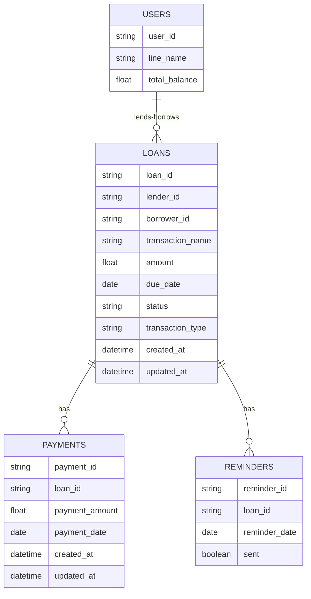

```mermaid
erDiagram
  USERS ||--o{ LOANS : "lends-borrows"
  LOANS ||--o{ PAYMENTS : "has"
  LOANS ||--o{ REMINDERS : "has"
  USERS {
    string user_id
    string line_name
    float total_balance
  }
  LOANS {
    string loan_id
    string lender_id
    string borrower_id
    string transaction_name
    float amount
    date due_date
    string status
    string transaction_type
    datetime created_at
    datetime updated_at
  }
  PAYMENTS {
    string payment_id
    string loan_id
    float payment_amount
    date payment_date
    datetime created_at
    datetime updated_at
  }
  REMINDERS {
    string reminder_id
    string loan_id
    date reminder_date
    boolean sent
  }
```
