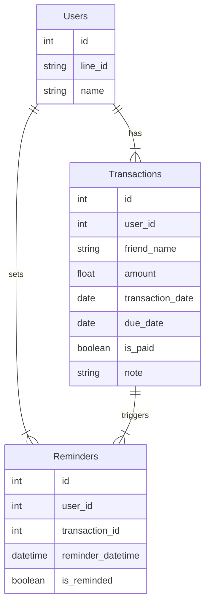

```mermaid
erDiagram
    Users ||--|{ Transactions : has
    Users ||--|{ Reminders : sets
    Transactions ||--|{ Reminders : triggers
    Users {
        int id
        string line_id
        string name
    }
    Transactions {
        int id
        int user_id
        string friend_name
        float amount
        date transaction_date
        date due_date
        boolean is_paid
        string note
    }
    Reminders {
        int id
        int user_id
        int transaction_id
        datetime reminder_datetime
        boolean is_reminded
    }
```
